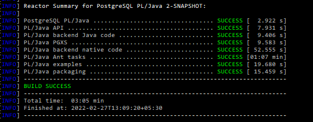

# JQuotes
PL/Java Functions with PostgreSql

## What is JQuotes by the way?
It is a PL/Java Function that runs in PostgreSql natively!  

## What does it do?
It gives you a fresh random popular Quote from a corpus of 100 odd ones!

## Okay, so how does this work?
Pretty Simple ....  
It leverages the PL/Java Library to register into PostgreSql!  
And once done ... runs natively in the Database!!  

## Wow! So how do I set it up?
Just follow the Steps Below.

## Pre-Requisites for the Setup:
1. Install Open JDK 17 from here ... https://jdk.java.net/17/
2. Install Netbeans Community Edition from here ... https://netbeans.apache.org/community/index.html
3. Install Visual Studio 2019 or 2022 Community Edition from here .... https://visualstudio.microsoft.com/downloads/
4. Ensure you have added and installed the VC++ Native x64 Tools Workload for Visual Studio Community Edition.
5. Install PostgreSql 14.2 for Windows x86-64 from here .... https://www.enterprisedb.com/downloads/postgres-postgresql-downloads
6. Download or Clone the PL/Java Project from Github from here ... https://github.com/tada/pljava

# Steps to Set it up & get things up & running:
1. Add psql from PostgreSql installation to the PATH
2. Install Java i.e. JDK-17.0.2
3. Add JAVA_HOME & java from the above to the PATH
4. Open x64 VS 2019 Native Tools Command Prompt

5. Switch to the cloned Github location of pljava
6. "[Path to Netbeans Root Folder]\netbeans\java\maven\bin\mvn" clean install -DskipTests  
Upon Success you should get something like the below:  

7. Run as Administrator: java -jar pljava-packaging/target/pljava-pg14.jar
8. psql -U postgres
9. GRANT USAGE ON LANGUAGE java TO PUBLIC;
10. SET pljava.policy_urls TO '"file:[Path to Downloaded JQuotes Repo with front slashes]/JQuotes/pljava.policy","="';
11. SET pljava.libjvm_location TO "[<Path to Java Root Folder]\jdk-17.0.2\bin\server\jvm.dll";
12. CREATE EXTENSION pljava;
13. GRANT USAGE ON LANGUAGE java TO PUBLIC;
14. SET client_min_messages TO NOTICE;
15. COPY [Path to pljava cloned repo with back slashes not escaped ]\pljava-api\target\pljava-api-2-SNAPSHOT.jar to ${project.basedir}/lib/pljava-api-2-SNAPSHOT.jar
16. select sqlj.install_jar('file:[Path to Downloaded JQuotes Repo with front slashes]/target/JQuotes-1.0-SNAPSHOT.jar', 'jquotes', true);
OR If Jar already exists ....
17. select sqlj.replace_jar('file:[Path to Downloaded JQuotes Repo with front slashes]/target/JQuotes-1.0-SNAPSHOT.jar', 'jquotes', true);
18. select sqlj.set_classpath('public', 'jquotes');
19. select quote();

20. That's It!! You're all set! Get refreshed & inspired by the quotes!!!!

## What's next?
Play around with the code ....  
Go through it ....  
Try to enhance it & customize according to your use case ...  
Last of all ... understand the beauty of the interoperability & appreciate the efforts put to get it to work!!!  
:-)

## Conclusion
The PL/Java interoperability with PostgreSql was successfully done!!
Cheers!!!
Happy Coding!!!  
